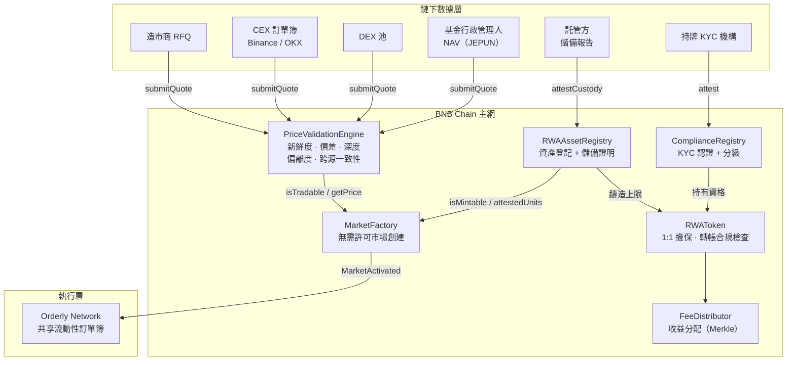

# DEXless — RWA 基礎設施技術說明

> 對應 BNB Chain 獎金要求 **5(2) RWA Infra 類**
> 版本 v1.0 ｜ 網路：BNB Chain Mainnet (chainId 56)

---

## 1. 所解決的核心問題

**真實世界資產無法上鏈交易的瓶頸，不在「發行」，而在「定價」。**

把一份資產鑄成 Token 只需要一個 ERC-20。真正的困難是：**這顆 Token 該值多少錢？**
黃金、基金份額、應收帳款這類資產沒有 24/7 的深度市場，既有作法都有結構性缺陷：

| 現行作法 | 失效原因 |
| --- | --- |
| 單一 Oracle 餵價 | 單點故障；來源被操縱即全盤錯誤 |
| 單一 CEX 參考價 | 休市、下架、流動性枯竭時直接斷線 |
| 人工審核上架 | 中心化審批，數週流程，無法規模化 |

結果是：**資產上鏈了，市場卻開不起來。**

DEXless 的立場是 —— **我們不相信價格，我們驗證市場（We don't rely on prices. We validate markets.）**
系統不預設任何單一來源可信，而是要求多個獨立來源在鏈上「彼此同意」，
並把整個驗證過程與拒絕理由寫成鏈上事件，任何人都可稽核。

---

## 2. 如何支持 RWA 上鏈

本專案實作了 RWA Infra 類要求的**四項核心基礎能力**，全部部署於 BNB Chain 主網：

### 2.1 數據上鏈模組（Oracle / API → on-chain）
`PriceValidationEngine`

多來源價格匯入 + 鏈上五重驗證：

1. **新鮮度檢查** — 報價年齡 ≤ `maxStaleness`
2. **價差控制** — `(ask − bid) / mid` ≤ `maxSpreadBps`
3. **深度驗證** — 可成交名目 ≥ `minDepth`
4. **偏離度檢查** — `|price − median| / median` ≤ `maxDeviationBps`
5. **跨源一致性** — 存活來源數 ≥ `minSources`，且橫跨 ≥ `minDistinctKinds` 種來源類別

來源類別涵蓋 `MM_QUOTE`（造市商報價）／`CEX`／`DEX`／`ORACLE`／`NAV`（基金行政管理人淨值）。
最終價格取存活來源的**中位數**，而非平均數 —— 中位數對單一離群值免疫。

連續失敗達 `failuresToPause` 次，Feed **自動暫停**並停止對外供價，須人工調查後才能恢復。

### 2.2 資產驗證 / 審計機制
`RWAAssetRegistry`

- 登記資產類別、發行方、託管方、司法管轄區
- 法律文件（託管合約、公開說明書、審計報告）存 IPFS，鏈上只留 **CID + keccak256 摘要**，
  任何人可驗證手上文件與登記版本一致
- **託管方定期上鏈申報儲備量（Proof of Reserve）**；申報逾 35 天未更新，
  資產自動失去可鑄造資格

### 2.3 合規 / KYC / 身份模組
`ComplianceRegistry`

- 鏈下 KYC 由持牌機構執行，鏈上只寫入**記錄雜湊**，個資永不上鏈
- 投資人分級：`RETAIL` / `ACCREDITED` / `INSTITUTIONAL`
- 支援效期、撤銷、**司法管轄區封鎖**（制裁名單國家自動失效）
- `totalAttested()` 為鏈上可驗證的真實用戶計數 —— 每一位都對應一筆授權機構簽發的認證

### 2.4 資產發行工具（合約模板）
`MarketFactory` + `RWAToken`

- **無需許可開市場**：任何人可提案，無人審批
- 提案後市場必須「養熟」：其價格 Feed 需在 `seasoningPeriod` 期間內
  通過 `requiredValidations` 次驗證，才能被**任何人**呼叫啟用
- 保證金全額退還（啟用或駁回皆然），只作為防灌水的資金鎖定成本
- `RWAToken` 在合約層強制 **1:1 足額擔保**：鑄造量永遠不得超過託管方最新申報的儲備量

---

## 3. 系統架構



---

## 4. 使用流程

```
① 資產登記   registrar → RWAAssetRegistry.registerAsset()
              資產進入 PENDING 狀態

② 儲備申報   custodian → RWAAssetRegistry.attestCustody()
              首次申報後自動轉為 ACTIVE，取得可鑄造資格

③ 建立價源   feed admin → PriceValidationEngine.createFeed() + addSource()
              為每個來源註冊獨立的報價者位址

④ 持續驗證   keeper → submitQuote() × N 來源 → validate()
              每 5 分鐘一輪，PriceValidated / ValidationFailed 事件全程上鏈

⑤ 投資人認證 attester → ComplianceRegistry.attest()
              寫入 KYC 記錄雜湊，不含任何個資

⑥ 1:1 鑄造   minter → RWAToken.mint()
              合約檢查：資產 ACTIVE + 申報新鮮 + 總量不超過儲備

⑦ 市場提案   任何人 → MarketFactory.proposeMarket()（附保證金）

⑧ 市場啟用   任何人 → MarketFactory.activateMarket()
              合約自行驗證養熟條件，無人為審批

⑨ 交易流轉   持有人 → RWAToken.transfer()（雙方須通過合規檢查）

⑩ 收益分配   operator → FeeDistributor.openRound()
              持有人 → claim()，Merkle 證明自行提領

⑪ 贖回銷毀   持有人 → RWAToken.requestRedemption()
              鏈下結算後，託管方下次申報反映儲備減少
```

**安全機制（全程自動）**
- Feed 連續驗證失敗 → 自動暫停供價
- 任何人可呼叫 `MarketFactory.pauseUnhealthyMarket()` 停用價源異常的市場，
  不需等待團隊介入
- 託管申報過期 → 資產自動失去可鑄造資格

---

## 5. 合約清單

| 合約 | 職責 | 對應要求 |
| --- | --- | --- |
| `PriceValidationEngine` | 多源價格驗證引擎 | 5(2) 數據上鏈模組 |
| `RWAAssetRegistry` | 資產登記 + 儲備證明 | 5(2) 資產驗證 / 審計機制 |
| `ComplianceRegistry` | KYC / 身份 / 分級 | 5(2) 合規模組 |
| `MarketFactory` | 無需許可市場創建 | 5(2) 資產發行工具 |
| `RWAToken` | 1:1 擔保代幣 | 5(1) 資產上鏈 |
| `FeeDistributor` | 收益分配 | 第 4 條「收益分配」業務邏輯 |

> 部署位址與 BscScan 連結見 [`onchain-flow.md`](./onchain-flow.md)。
> 完整原始碼、測試（74 項）與部署腳本見專案 GitHub。

---

## 6. 開放性

所有合約皆為**無需許可讀取**：任何第三方協議都能直接呼叫
`PriceValidationEngine.getPrice()` 取得經驗證的 RWA 價格，
或呼叫 `RWAAssetRegistry.isMintable()` 檢查資產擔保狀態。

DEXless 不是一個封閉產品，而是 **BNB Chain 上任何 RWA 專案都能接入的公共定價基礎設施**。
